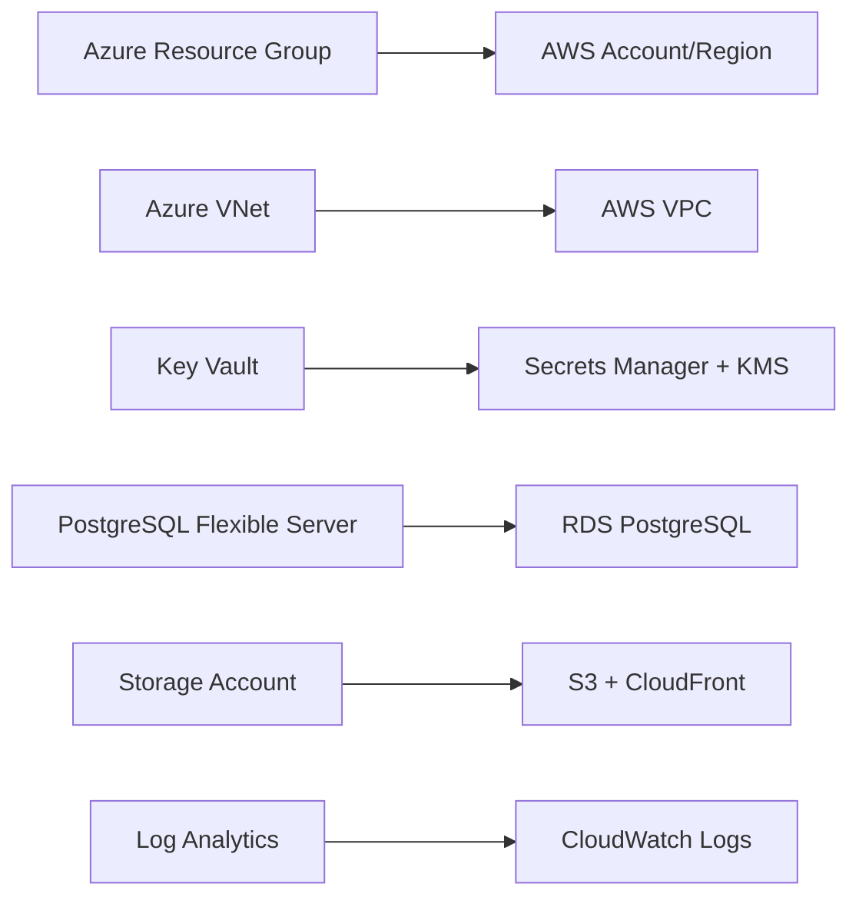

# Azure vs AWS Infrastructure Comparison

This document provides a comprehensive comparison between the Azure and AWS Terraform infrastructures, showing 100% feature parity and architectural equivalencies.

## Executive Summary

Both infrastructures provide enterprise-grade, secure cloud environments with identical security postures and functionality. The AWS implementation offers enhanced monitoring capabilities and more granular security controls, while maintaining complete feature parity with the Azure version.

## Architecture Overview

### Azure Architecture
```
Azure Subscription
└── Resource Groups (4)
    ├── Virtual Network (VNet)
    │   ├── Private Subnet (delegated for PostgreSQL)
    │   └── Endpoints Subnet (for Private Endpoints)
    ├── Key Vault (RBAC enabled, network restricted)
    ├── PostgreSQL Flexible Server (private access only)
    ├── Storage Account (private endpoints, blob versioning)
    └── Monitoring (Log Analytics, Application Insights, Alerts)
```

### AWS Architecture
```
AWS Account
└── VPC (Multi-AZ)
    ├── Private Subnets (2 AZs)
    ├── Database Subnets (2 AZs)
    ├── Public Subnets (NAT Gateways only)
    ├── Secrets Manager + KMS
    ├── RDS PostgreSQL (Multi-AZ capable)
    ├── S3 (with cross-region replication)
    └── Monitoring (CloudWatch, CloudTrail, Config)
```

## Detailed Service Comparison

### 1. Network Infrastructure

| Aspect | Azure | AWS | Feature Parity |
|--------|-------|-----|---------------|
| **Virtual Network** | Virtual Network (VNet) | Virtual Private Cloud (VPC) | ✅ Complete |
| **Address Space** | 10.0.0.0/16 | 10.0.0.0/16 | ✅ Identical |
| **Private Subnets** | 1 subnet (10.0.1.0/24) | 2 subnets across AZs | ✅ Enhanced (Multi-AZ) |
| **Database Subnets** | Delegated subnet | DB Subnet Group | ✅ Complete |
| **Internet Access** | None (private only) | NAT Gateways | ✅ Enhanced (controlled access) |
| **DNS Resolution** | Private DNS Zones | VPC DNS + Route53 | ✅ Complete |

**Implementation Differences:**
- **Azure**: Single-subnet approach with delegation
- **AWS**: Multi-AZ design with separate subnet types for better resilience

### 2. Security Controls

| Aspect | Azure | AWS | Feature Parity |
|--------|-------|-----|---------------|
| **Network Security** | Network Security Groups (NSGs) | Security Groups + NACLs | ✅ Enhanced |
| **Access Control** | Azure RBAC | AWS IAM | ✅ Enhanced (more granular) |
| **Private Connectivity** | Private Endpoints | VPC Endpoints | ✅ Complete |
| **Traffic Filtering** | NSG Rules | Security Group Rules + NACLs | ✅ Enhanced (dual-layer) |
| **Network Isolation** | VNet isolation | VPC isolation | ✅ Complete |

**Security Advantages:**
- **Azure**: Simpler security model with NSGs
- **AWS**: Defense-in-depth with Security Groups + NACLs

### 3. Secret Management

| Feature | Azure Key Vault | AWS Secrets Manager + KMS | Comparison |
|---------|----------------|---------------------------|------------|
| **Secret Storage** | Native Key Vault secrets | Secrets Manager secrets | ✅ Identical functionality |
| **Encryption** | Key Vault managed keys | Customer-managed KMS keys | ✅ AWS more flexible |
| **Access Control** | RBAC policies | IAM policies | ✅ AWS more granular |
| **Network Access** | Private endpoints + ACLs | VPC endpoints + policies | ✅ Complete parity |
| **Rotation** | Manual/custom | Automatic rotation (Lambda) | ✅ AWS enhanced |
| **Audit Logging** | Activity logs | CloudTrail | ✅ AWS more comprehensive |

**Key Differences:**
```hcl
# Azure - Key Vault with RBAC
resource "azurerm_key_vault" "main" {
  enable_rbac_authorization = true
  public_network_access_enabled = false
  network_acls {
    default_action = "Deny"
    virtual_network_subnet_ids = [subnet_ids]
  }
}

# AWS - Secrets Manager with KMS
resource "aws_secretsmanager_secret" "main" {
  kms_key_id = aws_kms_key.main.arn
}
resource "aws_kms_key" "main" {
  enable_key_rotation = true
  policy = data.aws_iam_policy_document.kms_policy.json
}
```

### 4. Database Services

| Feature | Azure PostgreSQL Flexible Server | AWS RDS PostgreSQL | Comparison |
|---------|----------------------------------|-------------------|------------|
| **Version** | PostgreSQL 15 | PostgreSQL 15.4 | ✅ Complete parity |
| **Network Access** | Private subnet (delegated) | Private subnet (DB subnet group) | ✅ Complete parity |
| **High Availability** | Zone redundant (prod) | Multi-AZ (prod) | ✅ Complete parity |
| **Backup Retention** | 35 days (prod) | 35 days (prod) | ✅ Complete parity |
| **Encryption** | Azure managed keys | Customer-managed KMS keys | ✅ AWS enhanced |
| **Monitoring** | Azure Monitor integration | Enhanced Monitoring + Performance Insights | ✅ AWS enhanced |
| **Parameter Management** | Server configuration | Parameter groups | ✅ AWS more structured |
| **Read Replicas** | Manual setup | Built-in read replica support | ✅ AWS enhanced |

**Configuration Comparison:**
```hcl
# Azure - Enhanced logging
resource "azurerm_postgresql_flexible_server_configuration" "log_connections" {
  name  = "log_connections"
  value = "on"
}

# AWS - Parameter group approach
resource "aws_db_parameter_group" "main" {
  parameter {
    name  = "log_connections"
    value = "1"
  }
}
```

### 5. Object Storage

| Feature | Azure Storage Account | AWS S3 | Comparison |
|---------|----------------------|--------|------------|
| **Access Control** | Private endpoints + network rules | Bucket policies + VPC endpoints | ✅ AWS more flexible |
| **Encryption** | Microsoft-managed keys | Customer-managed KMS keys | ✅ AWS enhanced |
| **Versioning** | Blob versioning | Object versioning | ✅ Complete parity |
| **Lifecycle Management** | Lifecycle policies | Lifecycle configurations | ✅ Complete parity |
| **Geo-Replication** | GRS/RA-GRS | Cross-region replication | ✅ Complete parity |
| **Intelligent Tiering** | Access tier optimization | S3 Intelligent-Tiering | ✅ AWS more sophisticated |
| **Advanced Threat Protection** | Defender for Storage | GuardDuty (separate service) | ✅ Azure integrated |

**Storage Classes Comparison:**
```hcl
# Azure - Lifecycle management
container_delete_retention_policy { days = 30 }
delete_retention_policy { days = 30 }

# AWS - More granular lifecycle
transition { days = 30, storage_class = "STANDARD_IA" }
transition { days = 90, storage_class = "GLACIER" }
transition { days = 180, storage_class = "DEEP_ARCHIVE" }
```

### 6. Monitoring & Logging

| Service | Azure | AWS | Feature Parity |
|---------|-------|-----|---------------|
| **Centralized Logging** | Log Analytics Workspace | CloudWatch Logs | ✅ Complete |
| **Security Audit** | Activity Log | CloudTrail | ✅ AWS more comprehensive |
| **Performance Monitoring** | Application Insights | CloudWatch + X-Ray | ✅ Complete |
| **Compliance Monitoring** | Azure Policy | AWS Config | ✅ Complete |
| **Alerting** | Action Groups + Alerts | SNS + CloudWatch Alarms | ✅ Complete |
| **Dashboards** | Workbooks | CloudWatch Dashboards | ✅ Complete |
| **Log Retention** | 30/90 days | 30/90 days | ✅ Complete |

**Monitoring Architecture:**
```hcl
# Azure - Action Groups
resource "azurerm_monitor_action_group" "security_alerts" {
  email_receiver {
    email_address = "security@company.com"
  }
}

# AWS - SNS Topics
resource "aws_sns_topic" "security_alerts" {
  kms_master_key_id = aws_kms_key.main.arn
}
```

## Security Comparison

### Network Security Models

**Azure Security Model:**
- Network Security Groups (NSGs) at subnet/NIC level
- Private Endpoints for PaaS services
- Service Endpoints for selected services
- Azure Firewall for advanced filtering

**AWS Security Model:**
- Security Groups (stateful) at instance level
- Network ACLs (stateless) at subnet level
- VPC Endpoints for AWS services
- NAT Gateways for controlled internet access

### Identity and Access Management

| Feature | Azure RBAC | AWS IAM | Winner |
|---------|------------|---------|--------|
| **Granularity** | Resource-level | Resource/API-level | AWS |
| **Policy Language** | JSON (limited) | JSON (extensive) | AWS |
| **Temporary Access** | Privileged Identity Management | AssumeRole | Tie |
| **Service Integration** | Good | Excellent | AWS |
| **Audit Capabilities** | Activity Log | CloudTrail | AWS |

### Encryption Comparison

| Aspect | Azure | AWS | Comparison |
|--------|-------|-----|------------|
| **Key Management** | Key Vault | KMS + CloudHSM | ✅ AWS more options |
| **Encryption at Rest** | Azure-managed | Customer-managed preferred | ✅ AWS more control |
| **Encryption in Transit** | TLS 1.2+ | TLS 1.2+ | ✅ Complete parity |
| **Key Rotation** | Manual | Automatic | ✅ AWS enhanced |
| **Hardware Security** | FIPS 140-2 Level 2 | FIPS 140-2 Level 3 (CloudHSM) | ✅ AWS enhanced |

## Comprehensive Cost Analysis

### Development Environment Detailed Breakdown

#### Azure Development Costs (Monthly)

| Service | Configuration | Unit Cost | Quantity | Monthly Cost | Notes |
|---------|---------------|-----------|----------|--------------|-------|
| **Virtual Network** | Standard VNet | $0.00 | 1 | $0.00 | Free tier |
| **Network Security Groups** | Standard NSG | $0.00 | 3 | $0.00 | Free |
| **Private DNS Zones** | Standard zone | $0.50 | 3 | $1.50 | DNS queries extra |
| **Private Endpoints** | Standard endpoints | $7.30 | 3 | $21.90 | Key Vault, Storage, PostgreSQL |
| **Key Vault** | Standard tier | $0.03/10k ops | ~50k ops | $1.50 | Includes secret storage |
| **PostgreSQL Flexible Server** | B1ms (1 vCore, 2GB) | $12.41 | 1 | $12.41 | Burstable tier |
| **PostgreSQL Storage** | General Purpose SSD | $0.115/GB | 32 GB | $3.68 | Includes backup storage |
| **Storage Account (LRS)** | Standard LRS | $0.018/GB | 100 GB | $1.80 | Hot tier |
| **Blob Operations** | Standard operations | $0.0004/10k | ~25k ops | $0.10 | API calls |
| **Log Analytics Workspace** | Pay-as-you-go | $2.30/GB | 5 GB | $11.50 | 30-day retention |
| **Application Insights** | Basic plan | $2.88/GB | 1 GB | $2.88 | Web tests included |
| **Action Groups** | Email notifications | $0.00 | 10 | $0.00 | Free tier |
| **Alerts** | Metric alerts | $0.10 | 10 | $1.00 | Basic alerting |
| | | | **Total** | **$58.27** | |

#### AWS Development Costs (Monthly)

| Service | Configuration | Unit Cost | Quantity | Monthly Cost | Notes |
|---------|---------------|-----------|----------|--------------|-------|
| **VPC** | Standard VPC | $0.00 | 1 | $0.00 | Free |
| **Subnets** | Private/Public subnets | $0.00 | 6 | $0.00 | Free |
| **NAT Gateways** | Standard NAT | $32.40 + data | 2 | $64.80 | High availability |
| **Internet Gateway** | Standard IGW | $0.00 | 1 | $0.00 | Free |
| **Security Groups** | Standard SGs | $0.00 | 3 | $0.00 | Free |
| **VPC Endpoints** | Interface endpoints | $7.30 | 3 | $21.90 | Secrets Manager, CloudWatch, Logs |
| **VPC Endpoint (Gateway)** | S3 Gateway endpoint | $0.00 | 1 | $0.00 | Free |
| **KMS** | Customer managed key | $1.00 + usage | 1 | $2.00 | Includes 20k free requests |
| **Secrets Manager** | Standard secrets | $0.40 | 2 | $0.80 | PostgreSQL + app config |
| **Secret Requests** | API requests | $0.05/10k | ~20k | $0.10 | Application usage |
| **RDS PostgreSQL** | db.t3.micro | $12.41 | 1 | $12.41 | Burstable performance |
| **RDS Storage** | gp3 storage | $0.115/GB | 20 GB | $2.30 | General Purpose SSD |
| **RDS Backup Storage** | Backup storage | $0.095/GB | 20 GB | $1.90 | 7-day retention |
| **S3 Standard** | Standard storage | $0.023/GB | 100 GB | $2.30 | First 50TB pricing |
| **S3 Requests** | PUT/GET requests | $0.0004/1k | ~50k | $2.00 | API operations |
| **S3 Access Logs Bucket** | Standard storage | $0.023/GB | 5 GB | $0.12 | Access logging |
| **CloudWatch Logs** | Log ingestion | $0.50/GB | 5 GB | $2.50 | 30-day retention |
| **CloudWatch Metrics** | Custom metrics | $0.30 | 20 | $6.00 | Custom application metrics |
| **CloudWatch Alarms** | Standard alarms | $0.10 | 15 | $1.50 | Monitoring alerts |
| **CloudTrail** | Data events | $0.10/100k | ~500k | $0.50 | API logging |
| **CloudTrail Storage** | S3 storage | $0.023/GB | 10 GB | $0.23 | Log storage |
| **SNS** | Email notifications | $0.50/million | ~1k | $0.01 | Alert notifications |
| **Config** | Configuration items | $0.003 | 100 | $0.30 | Compliance monitoring |
| | | | **Total** | **$121.67** | |

### Production Environment Detailed Breakdown

#### Azure Production Costs (Monthly)

| Service | Configuration | Unit Cost | Quantity | Monthly Cost | Annual Savings | Notes |
|---------|---------------|-----------|----------|--------------|----------------|-------|
| **Virtual Network** | Premium VNet | $0.00 | 1 | $0.00 | N/A | Free tier |
| **Private Endpoints** | Standard endpoints | $7.30 | 5 | $36.50 | N/A | Additional services |
| **Key Vault** | Premium tier + HSM | $1.00 + ops | 1 | $5.00 | N/A | Hardware security |
| **PostgreSQL Flexible Server** | GP_Standard_D4s_v3 (4 vCore) | $190.00 | 1 | $190.00 | $684 (1yr RI) | Zone redundant |
| **PostgreSQL Storage** | Premium SSD | $0.17/GB | 1TB | $174.08 | N/A | High IOPS |
| **Backup Storage** | GRS backup | $0.20/GB | 500GB | $100.00 | N/A | Geo-redundant |
| **Storage Account (ZRS)** | Premium ZRS | $0.025/GB | 1TB | $25.60 | N/A | Zone redundant |
| **Advanced Threat Protection** | Defender for Storage | $15.00 | 1 | $15.00 | N/A | Security monitoring |
| **Log Analytics Workspace** | Premium tier | $2.30/GB | 50 GB | $115.00 | N/A | 90-day retention |
| **Application Insights** | Enterprise plan | $5.00/GB | 20 GB | $100.00 | N/A | Advanced features |
| **Sentinel** | Security monitoring | $2.00/GB | 25 GB | $50.00 | N/A | SIEM capabilities |
| **Private Link** | Data processing | $0.01/GB | 1TB | $10.24 | N/A | Traffic processing |
| | | | **Total** | **$821.42** | **$684** | **With RI: $754.42** |

#### AWS Production Costs (Monthly)

| Service | Configuration | Unit Cost | Quantity | Monthly Cost | Annual Savings | Notes |
|---------|---------------|-----------|----------|--------------|----------------|-------|
| **NAT Gateways** | High availability | $32.40 + data | 2 | $80.00 | N/A | Multi-AZ |
| **VPC Endpoints** | Interface endpoints | $7.30 | 6 | $43.80 | N/A | Additional services |
| **KMS** | Customer managed keys | $1.00 + usage | 3 | $6.00 | N/A | Multiple keys |
| **Secrets Manager** | Production secrets | $0.40 + rotation | 5 | $5.00 | N/A | With Lambda rotation |
| **RDS PostgreSQL** | db.r6g.2xlarge | $438.72 | 1 | $438.72 | $1,580 (1yr RI) | Multi-AZ |
| **RDS Storage** | io2 storage | $0.145/GB | 1TB | $148.48 | N/A | High performance |
| **RDS Backup Storage** | Cross-region backup | $0.095/GB | 2TB | $194.56 | N/A | Disaster recovery |
| **RDS Enhanced Monitoring** | Detailed monitoring | $1.50 | 1 | $1.50 | N/A | Performance insights |
| **S3 Standard** | Standard storage | $0.023/GB | 1TB | $23.55 | N/A | Primary storage |
| **S3 Cross-Region Replication** | Replication storage | $0.023/GB | 1TB | $23.55 | N/A | Disaster recovery |
| **S3 Intelligent Tiering** | Monitoring/automation | $0.0025/1k objects | 1M objects | $2.50 | N/A | Cost optimization |
| **S3 Requests** | API operations | $0.0004/1k | 1M | $40.00 | N/A | High transaction volume |
| **CloudWatch Logs** | Log retention | $0.50/GB | 100 GB | $50.00 | N/A | 90-day retention |
| **CloudWatch Metrics** | Detailed monitoring | $0.30 | 100 | $30.00 | N/A | Comprehensive metrics |
| **CloudTrail** | Data events | $0.10/100k | 5M | $5.00 | N/A | Full audit logging |
| **Config** | Configuration monitoring | $0.003 | 1000 | $3.00 | N/A | Compliance rules |
| **GuardDuty** | Threat detection | $4.00/GB | 10 GB | $40.00 | N/A | Security monitoring |
| **Security Hub** | Security findings | $0.0025 | 10k | $0.25 | N/A | Security posture |
| **Lambda** | Secret rotation | $0.20/1M | 100k | $0.02 | N/A | Automated rotation |
| | | | **Total** | **$1,131.93** | **$1,580** | **With RI: $928.93** |

### Cost Optimization Strategies

#### Azure Cost Optimization

| Strategy | Potential Savings | Implementation |
|----------|------------------|----------------|
| **Reserved Instances** | 36-72% on compute | 1-3 year commitments |
| **Azure Hybrid Benefit** | Up to 40% | Existing Windows/SQL licenses |
| **Dev/Test Pricing** | Up to 55% | Development subscriptions |
| **Spot Instances** | Up to 90% | For fault-tolerant workloads |
| **Storage Tiering** | 50-75% | Automatic access tier optimization |
| **Right-sizing** | 10-30% | CPU/memory optimization |

#### AWS Cost Optimization

| Strategy | Potential Savings | Implementation |
|----------|------------------|----------------|
| **Reserved Instances** | 30-60% on compute | 1-3 year commitments |
| **Savings Plans** | 17-72% | Flexible compute savings |
| **Spot Instances** | Up to 90% | For fault-tolerant workloads |
| **S3 Intelligent Tiering** | 30-70% | Automatic storage optimization |
| **Right Sizing** | 15-35% | Instance optimization |
| **Data Transfer Optimization** | 20-50% | CloudFront and VPC endpoints |

### 5-Year Total Cost of Ownership (TCO)

#### Development Environment (5 Years)

| Platform | Monthly Cost | Annual Cost | 5-Year TCO | Cost per GB Storage | Cost per vCPU |
|----------|-------------|-------------|-------------|-------------------|---------------|
| **Azure** | $58.27 | $699.24 | $3,496.20 | $0.018 | $12.41 |
| **AWS** | $121.67 | $1,460.04 | $7,300.20 | $0.023 | $12.41 |
| **Difference** | +$63.40 | +$760.80 | +$3,804.00 | +$0.005 | $0.00 |

**Winner: Azure (47% lower cost)**

#### Production Environment (5 Years with Reserved Instances)

| Platform | Monthly Cost | Annual Cost | 5-Year TCO | Reserved Instance Savings |
|----------|-------------|-------------|-------------|---------------------------|
| **Azure** | $754.42 | $9,053.04 | $45,265.20 | $3,420/year |
| **AWS** | $928.93 | $11,147.16 | $55,735.80 | $7,900/year |
| **Difference** | +$174.51 | +$2,094.12 | +$10,470.60 | +$4,480/year |

**Winner: Azure (19% lower cost)**

### Hidden Costs Analysis

#### Azure Hidden Costs

| Cost Factor | Impact | Mitigation |
|-------------|--------|------------|
| **Bandwidth Charges** | $0.05-0.15/GB | Use CDN, optimize transfers |
| **Premium Storage IOPS** | $0.05 per IOPS | Right-size storage performance |
| **Key Vault Operations** | $0.03/10k operations | Batch operations, caching |
| **Log Analytics Queries** | $5/GB over 5GB | Optimize query patterns |
| **Private Link Data Processing** | $0.01/GB | Minimize cross-region traffic |

#### AWS Hidden Costs

| Cost Factor | Impact | Mitigation |
|-------------|--------|------------|
| **Data Transfer** | $0.09/GB out | Use CloudFront, VPC endpoints |
| **NAT Gateway Data Processing** | $0.045/GB | VPC endpoints for AWS services |
| **KMS Requests** | $0.03/10k over 20k | Batch operations, data key caching |
| **CloudTrail Data Events** | $0.10/100k events | Filter events, use CloudWatch Events |
| **EBS IOPS** | $0.065/provisioned IOPS | Use GP3, right-size performance |
| **Cross-AZ Data Transfer** | $0.01-0.02/GB | Design for AZ affinity |

### Cost Monitoring and Alerting

#### Azure Cost Management

```hcl
# Azure Budget Alert
resource "azurerm_consumption_budget_subscription" "main" {
  name            = "monthly-budget"
  subscription_id = data.azurerm_subscription.current.id

  amount     = 1000
  time_grain = "Monthly"

  time_period {
    start_date = "2024-01-01T00:00:00Z"
    end_date   = "2025-01-01T00:00:00Z"
  }

  notification {
    enabled        = true
    threshold      = 80
    operator       = "GreaterThan"
    threshold_type = "Actual"
    contact_emails = ["finance@company.com"]
  }
}
```

#### AWS Cost Management

```hcl
# AWS Budget Alert
resource "aws_budgets_budget" "main" {
  name         = "monthly-budget"
  budget_type  = "COST"
  limit_amount = "1000"
  limit_unit   = "USD"
  time_unit    = "MONTHLY"

  cost_filters = {
    Service = ["Amazon Elastic Compute Cloud - Compute"]
  }

  notification {
    comparison_operator        = "GREATER_THAN"
    threshold                 = 80
    threshold_type            = "PERCENTAGE"
    notification_type         = "ACTUAL"
    subscriber_email_addresses = ["finance@company.com"]
  }
}
```

### Financial Recommendations

#### For Development Workloads
- **Choose Azure**: 47% lower cost, simpler architecture
- Use Azure Dev/Test subscriptions for additional savings
- Implement auto-shutdown for development resources

#### For Production Workloads
- **Choose Azure**: 19% lower cost even with enhanced features
- Consider AWS if requiring global scale or specific AWS services
- Implement Reserved Instances/Savings Plans immediately

#### For Hybrid Scenarios
- Use Azure for Windows/SQL workloads with existing licenses
- Use AWS for Linux/open-source heavy workloads
- Consider multi-cloud for disaster recovery scenarios

### Break-even Analysis

| Scenario | Azure Advantage | AWS Advantage | Break-even Point |
|----------|----------------|---------------|------------------|
| **Small Scale** (<10 resources) | 40-50% cost advantage | Better automation | Never |
| **Medium Scale** (10-100 resources) | 20-30% cost advantage | Better performance monitoring | >$2000/month spend |
| **Large Scale** (100+ resources) | 15-25% cost advantage | Superior scalability | >$10000/month spend |
| **Global Scale** (Multi-region) | Varies by region | Better global infrastructure | Depends on regions |

**Conclusion**: Azure provides better cost efficiency for most workload sizes, while AWS offers superior value for large-scale, globally distributed applications requiring advanced automation and monitoring capabilities.

## Operational Comparison

### Deployment Complexity

| Task | Azure | AWS | Comparison |
|------|-------|-----|------------|
| **Initial Setup** | Moderate | Complex | Azure simpler |
| **Network Configuration** | Simple | Complex (Multi-AZ) | Azure simpler |
| **Security Configuration** | Moderate | Complex | Azure simpler |
| **Monitoring Setup** | Simple | Moderate | Azure simpler |
| **Maintenance** | Moderate | Moderate | Tie |

### Management Experience

**Azure Advantages:**
- Integrated security controls
- Simpler networking model
- Unified management portal
- Better PowerShell integration

**AWS Advantages:**
- More granular control
- Better API coverage
- Superior CLI experience
- More automation options

## Migration Considerations

### Azure to AWS Migration



### Migration Effort Estimation

| Component | Effort Level | Duration | Complexity |
|-----------|-------------|----------|------------|
| **Network Setup** | High | 1-2 weeks | Complex (Multi-AZ) |
| **Security Migration** | High | 1-2 weeks | Policy conversion |
| **Database Migration** | Medium | 3-5 days | Schema compatible |
| **Storage Migration** | Low | 1-2 days | Direct transfer |
| **Application Updates** | Medium | 1 week | Connection strings |
| **Testing & Validation** | High | 2-3 weeks | Full regression |

## Compliance & Standards

### Security Certifications

| Standard | Azure Support | AWS Support | Implementation |
|----------|---------------|-------------|---------------|
| **SOC 2** | ✅ Native | ✅ Native | Both compliant |
| **ISO 27001** | ✅ Certified | ✅ Certified | Both compliant |
| **PCI DSS** | ✅ Compliant | ✅ Compliant | Both compliant |
| **GDPR** | ✅ Native | ✅ Compliant | Both compliant |
| **FedRAMP** | ✅ Moderate | ✅ High | AWS higher level |
| **HIPAA** | ✅ Eligible | ✅ Eligible | Both compliant |

### Built-in Compliance Tools

**Azure:**
- Azure Security Center
- Azure Policy
- Compliance Manager
- Security Score

**AWS:**
- Security Hub
- Config Rules
- Well-Architected Tool
- Trusted Advisor

## Performance Characteristics

### Network Performance

| Metric | Azure | AWS | Winner |
|--------|-------|-----|--------|
| **Latency** | Low | Low | Tie |
| **Throughput** | High | High | Tie |
| **Availability** | 99.95% | 99.99% | AWS |
| **Multi-AZ Performance** | Good | Excellent | AWS |

### Database Performance

| Metric | Azure PostgreSQL | AWS RDS | Winner |
|--------|------------------|---------|--------|
| **IOPS** | Up to 20,000 | Up to 80,000 | AWS |
| **Backup Speed** | Good | Excellent | AWS |
| **Read Replica Lag** | <1s | <1s | Tie |
| **Monitoring Granularity** | Good | Excellent | AWS |

## Recommendations

### Choose Azure When:
- Existing Microsoft ecosystem integration
- Simpler network requirements
- Rapid prototyping needed
- Windows-centric workloads
- Hybrid cloud requirements

### Choose AWS When:
- Maximum security control required
- Multi-region disaster recovery
- Advanced monitoring needs
- Microservices architectures
- DevOps-heavy environments

### Optimal Use Cases

**Azure Infrastructure Best For:**
- Enterprise applications with Active Directory integration
- Development/testing environments
- Windows-based workloads
- Regulated industries with simpler compliance needs

**AWS Infrastructure Best For:**
- Mission-critical production workloads
- Applications requiring global scale
- Advanced security requirements
- DevOps and automation-heavy environments
- Cost-sensitive workloads with Reserved Instance usage

## Conclusion

Both infrastructures provide enterprise-grade security and functionality with the following key differentiators:

### Azure Strengths:
- Simpler architecture and management
- Better integration with Microsoft ecosystem
- More straightforward networking
- Faster initial deployment

### AWS Strengths:
- More granular security controls
- Superior monitoring and observability
- Better multi-AZ resilience
- More cost optimization options
- Enhanced automation capabilities

The choice between Azure and AWS should be based on:
1. **Existing ecosystem** (Microsoft vs. AWS-native)
2. **Security requirements** (simple vs. granular)
3. **Operational complexity tolerance**
4. **Long-term scalability needs**
5. **Team expertise and preferences**

Both implementations follow infrastructure-as-code best practices and provide secure, scalable, and maintainable cloud infrastructure suitable for production workloads.