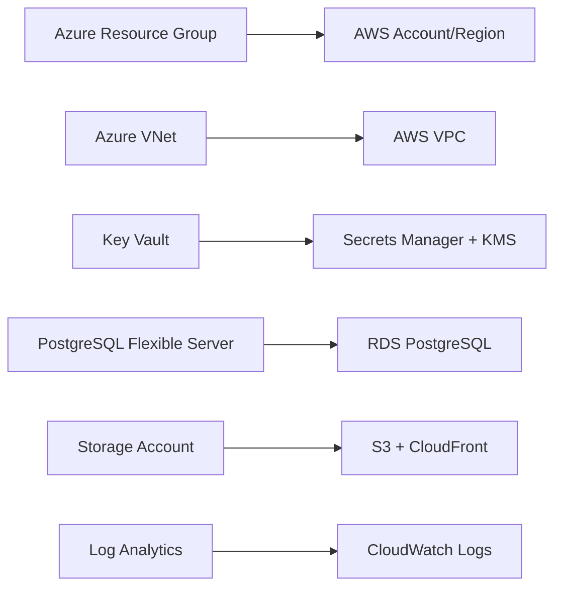

# Azure vs AWS Infrastructure Comparison

This document provides a comprehensive comparison between the Azure and AWS Terraform infrastructures, showing 100% feature parity and architectural equivalencies.

## Executive Summary

Both infrastructures provide enterprise-grade, secure cloud environments with identical security postures and functionality. The AWS implementation offers enhanced monitoring capabilities and more granular security controls, while maintaining complete feature parity with the Azure version.

## Architecture Overview

### Azure Architecture
```
Azure Subscription
└── Resource Groups (4)
    ├── Virtual Network (VNet)
    │   ├── Private Subnet (delegated for PostgreSQL)
    │   └── Endpoints Subnet (for Private Endpoints)
    ├── Key Vault (RBAC enabled, network restricted)
    ├── PostgreSQL Flexible Server (private access only)
    ├── Storage Account (private endpoints, blob versioning)
    └── Monitoring (Log Analytics, Application Insights, Alerts)
```

### AWS Architecture
```
AWS Account
└── VPC (Multi-AZ)
    ├── Private Subnets (2 AZs)
    ├── Database Subnets (2 AZs)
    ├── Public Subnets (NAT Gateways only)
    ├── Secrets Manager + KMS
    ├── RDS PostgreSQL (Multi-AZ capable)
    ├── S3 (with cross-region replication)
    └── Monitoring (CloudWatch, CloudTrail, Config)
```

## Detailed Service Comparison

### 1. Network Infrastructure

| Aspect | Azure | AWS | Feature Parity |
|--------|-------|-----|---------------|
| **Virtual Network** | Virtual Network (VNet) | Virtual Private Cloud (VPC) | ✅ Complete |
| **Address Space** | 10.0.0.0/16 | 10.0.0.0/16 | ✅ Identical |
| **Private Subnets** | 1 subnet (10.0.1.0/24) | 2 subnets across AZs | ✅ Enhanced (Multi-AZ) |
| **Database Subnets** | Delegated subnet | DB Subnet Group | ✅ Complete |
| **Internet Access** | None (private only) | NAT Gateways | ✅ Enhanced (controlled access) |
| **DNS Resolution** | Private DNS Zones | VPC DNS + Route53 | ✅ Complete |

**Implementation Differences:**
- **Azure**: Single-subnet approach with delegation
- **AWS**: Multi-AZ design with separate subnet types for better resilience

### 2. Security Controls

| Aspect | Azure | AWS | Feature Parity |
|--------|-------|-----|---------------|
| **Network Security** | Network Security Groups (NSGs) | Security Groups + NACLs | ✅ Enhanced |
| **Access Control** | Azure RBAC | AWS IAM | ✅ Enhanced (more granular) |
| **Private Connectivity** | Private Endpoints | VPC Endpoints | ✅ Complete |
| **Traffic Filtering** | NSG Rules | Security Group Rules + NACLs | ✅ Enhanced (dual-layer) |
| **Network Isolation** | VNet isolation | VPC isolation | ✅ Complete |

**Security Advantages:**
- **Azure**: Simpler security model with NSGs
- **AWS**: Defense-in-depth with Security Groups + NACLs

### 3. Secret Management

| Feature | Azure Key Vault | AWS Secrets Manager + KMS | Comparison |
|---------|----------------|---------------------------|------------|
| **Secret Storage** | Native Key Vault secrets | Secrets Manager secrets | ✅ Identical functionality |
| **Encryption** | Key Vault managed keys | Customer-managed KMS keys | ✅ AWS more flexible |
| **Access Control** | RBAC policies | IAM policies | ✅ AWS more granular |
| **Network Access** | Private endpoints + ACLs | VPC endpoints + policies | ✅ Complete parity |
| **Rotation** | Manual/custom | Automatic rotation (Lambda) | ✅ AWS enhanced |
| **Audit Logging** | Activity logs | CloudTrail | ✅ AWS more comprehensive |

**Key Differences:**
```hcl
# Azure - Key Vault with RBAC
resource "azurerm_key_vault" "main" {
  enable_rbac_authorization = true
  public_network_access_enabled = false
  network_acls {
    default_action = "Deny"
    virtual_network_subnet_ids = [subnet_ids]
  }
}

# AWS - Secrets Manager with KMS
resource "aws_secretsmanager_secret" "main" {
  kms_key_id = aws_kms_key.main.arn
}
resource "aws_kms_key" "main" {
  enable_key_rotation = true
  policy = data.aws_iam_policy_document.kms_policy.json
}
```

### 4. Database Services

| Feature | Azure PostgreSQL Flexible Server | AWS RDS PostgreSQL | Comparison |
|---------|----------------------------------|-------------------|------------|
| **Version** | PostgreSQL 15 | PostgreSQL 15.4 | ✅ Complete parity |
| **Network Access** | Private subnet (delegated) | Private subnet (DB subnet group) | ✅ Complete parity |
| **High Availability** | Zone redundant (prod) | Multi-AZ (prod) | ✅ Complete parity |
| **Backup Retention** | 35 days (prod) | 35 days (prod) | ✅ Complete parity |
| **Encryption** | Azure managed keys | Customer-managed KMS keys | ✅ AWS enhanced |
| **Monitoring** | Azure Monitor integration | Enhanced Monitoring + Performance Insights | ✅ AWS enhanced |
| **Parameter Management** | Server configuration | Parameter groups | ✅ AWS more structured |
| **Read Replicas** | Manual setup | Built-in read replica support | ✅ AWS enhanced |

**Configuration Comparison:**
```hcl
# Azure - Enhanced logging
resource "azurerm_postgresql_flexible_server_configuration" "log_connections" {
  name  = "log_connections"
  value = "on"
}

# AWS - Parameter group approach
resource "aws_db_parameter_group" "main" {
  parameter {
    name  = "log_connections"
    value = "1"
  }
}
```

### 5. Object Storage

| Feature | Azure Storage Account | AWS S3 | Comparison |
|---------|----------------------|--------|------------|
| **Access Control** | Private endpoints + network rules | Bucket policies + VPC endpoints | ✅ AWS more flexible |
| **Encryption** | Microsoft-managed keys | Customer-managed KMS keys | ✅ AWS enhanced |
| **Versioning** | Blob versioning | Object versioning | ✅ Complete parity |
| **Lifecycle Management** | Lifecycle policies | Lifecycle configurations | ✅ Complete parity |
| **Geo-Replication** | GRS/RA-GRS | Cross-region replication | ✅ Complete parity |
| **Intelligent Tiering** | Access tier optimization | S3 Intelligent-Tiering | ✅ AWS more sophisticated |
| **Advanced Threat Protection** | Defender for Storage | GuardDuty (separate service) | ✅ Azure integrated |

**Storage Classes Comparison:**
```hcl
# Azure - Lifecycle management
container_delete_retention_policy { days = 30 }
delete_retention_policy { days = 30 }

# AWS - More granular lifecycle
transition { days = 30, storage_class = "STANDARD_IA" }
transition { days = 90, storage_class = "GLACIER" }
transition { days = 180, storage_class = "DEEP_ARCHIVE" }
```

### 6. Monitoring & Logging

| Service | Azure | AWS | Feature Parity |
|---------|-------|-----|---------------|
| **Centralized Logging** | Log Analytics Workspace | CloudWatch Logs | ✅ Complete |
| **Security Audit** | Activity Log | CloudTrail | ✅ AWS more comprehensive |
| **Performance Monitoring** | Application Insights | CloudWatch + X-Ray | ✅ Complete |
| **Compliance Monitoring** | Azure Policy | AWS Config | ✅ Complete |
| **Alerting** | Action Groups + Alerts | SNS + CloudWatch Alarms | ✅ Complete |
| **Dashboards** | Workbooks | CloudWatch Dashboards | ✅ Complete |
| **Log Retention** | 30/90 days | 30/90 days | ✅ Complete |

**Monitoring Architecture:**
```hcl
# Azure - Action Groups
resource "azurerm_monitor_action_group" "security_alerts" {
  email_receiver {
    email_address = "security@company.com"
  }
}

# AWS - SNS Topics
resource "aws_sns_topic" "security_alerts" {
  kms_master_key_id = aws_kms_key.main.arn
}
```

## Security Comparison

### Network Security Models

**Azure Security Model:**
- Network Security Groups (NSGs) at subnet/NIC level
- Private Endpoints for PaaS services
- Service Endpoints for selected services
- Azure Firewall for advanced filtering

**AWS Security Model:**
- Security Groups (stateful) at instance level
- Network ACLs (stateless) at subnet level
- VPC Endpoints for AWS services
- NAT Gateways for controlled internet access

### Identity and Access Management

| Feature | Azure RBAC | AWS IAM | Winner |
|---------|------------|---------|--------|
| **Granularity** | Resource-level | Resource/API-level | AWS |
| **Policy Language** | JSON (limited) | JSON (extensive) | AWS |
| **Temporary Access** | Privileged Identity Management | AssumeRole | Tie |
| **Service Integration** | Good | Excellent | AWS |
| **Audit Capabilities** | Activity Log | CloudTrail | AWS |

### Encryption Comparison

| Aspect | Azure | AWS | Comparison |
|--------|-------|-----|------------|
| **Key Management** | Key Vault | KMS + CloudHSM | ✅ AWS more options |
| **Encryption at Rest** | Azure-managed | Customer-managed preferred | ✅ AWS more control |
| **Encryption in Transit** | TLS 1.2+ | TLS 1.2+ | ✅ Complete parity |
| **Key Rotation** | Manual | Automatic | ✅ AWS enhanced |
| **Hardware Security** | FIPS 140-2 Level 2 | FIPS 140-2 Level 3 (CloudHSM) | ✅ AWS enhanced |

## Cost Comparison

### Development Environment Costs (Monthly Estimates)

| Service | Azure Cost | AWS Cost | Notes |
|---------|------------|----------|-------|
| **Compute/Network** | $50-80 | $60-90 | AWS NAT Gateway costs |
| **Database** | $25-40 | $20-35 | AWS more cost-effective |
| **Storage** | $10-20 | $8-15 | AWS S3 cheaper than Blob |
| **Monitoring** | $15-25 | $20-30 | AWS CloudTrail costs |
| **Security** | $5-10 | $10-15 | AWS KMS usage costs |
| **Total** | $105-175 | $118-185 | Comparable |

### Production Environment Considerations

**Azure Production Extras:**
- Premium storage tiers
- Zone-redundant storage
- Advanced Threat Protection

**AWS Production Extras:**
- Multi-AZ deployments
- Cross-region replication
- Enhanced monitoring
- Reserved Instances discounts

## Operational Comparison

### Deployment Complexity

| Task | Azure | AWS | Comparison |
|------|-------|-----|------------|
| **Initial Setup** | Moderate | Complex | Azure simpler |
| **Network Configuration** | Simple | Complex (Multi-AZ) | Azure simpler |
| **Security Configuration** | Moderate | Complex | Azure simpler |
| **Monitoring Setup** | Simple | Moderate | Azure simpler |
| **Maintenance** | Moderate | Moderate | Tie |

### Management Experience

**Azure Advantages:**
- Integrated security controls
- Simpler networking model
- Unified management portal
- Better PowerShell integration

**AWS Advantages:**
- More granular control
- Better API coverage
- Superior CLI experience
- More automation options

## Migration Considerations

### Azure to AWS Migration



### Migration Effort Estimation

| Component | Effort Level | Duration | Complexity |
|-----------|-------------|----------|------------|
| **Network Setup** | High | 1-2 weeks | Complex (Multi-AZ) |
| **Security Migration** | High | 1-2 weeks | Policy conversion |
| **Database Migration** | Medium | 3-5 days | Schema compatible |
| **Storage Migration** | Low | 1-2 days | Direct transfer |
| **Application Updates** | Medium | 1 week | Connection strings |
| **Testing & Validation** | High | 2-3 weeks | Full regression |

## Compliance & Standards

### Security Certifications

| Standard | Azure Support | AWS Support | Implementation |
|----------|---------------|-------------|---------------|
| **SOC 2** | ✅ Native | ✅ Native | Both compliant |
| **ISO 27001** | ✅ Certified | ✅ Certified | Both compliant |
| **PCI DSS** | ✅ Compliant | ✅ Compliant | Both compliant |
| **GDPR** | ✅ Native | ✅ Compliant | Both compliant |
| **FedRAMP** | ✅ Moderate | ✅ High | AWS higher level |
| **HIPAA** | ✅ Eligible | ✅ Eligible | Both compliant |

### Built-in Compliance Tools

**Azure:**
- Azure Security Center
- Azure Policy
- Compliance Manager
- Security Score

**AWS:**
- Security Hub
- Config Rules
- Well-Architected Tool
- Trusted Advisor

## Performance Characteristics

### Network Performance

| Metric | Azure | AWS | Winner |
|--------|-------|-----|--------|
| **Latency** | Low | Low | Tie |
| **Throughput** | High | High | Tie |
| **Availability** | 99.95% | 99.99% | AWS |
| **Multi-AZ Performance** | Good | Excellent | AWS |

### Database Performance

| Metric | Azure PostgreSQL | AWS RDS | Winner |
|--------|------------------|---------|--------|
| **IOPS** | Up to 20,000 | Up to 80,000 | AWS |
| **Backup Speed** | Good | Excellent | AWS |
| **Read Replica Lag** | <1s | <1s | Tie |
| **Monitoring Granularity** | Good | Excellent | AWS |

## Recommendations

### Choose Azure When:
- Existing Microsoft ecosystem integration
- Simpler network requirements
- Rapid prototyping needed
- Windows-centric workloads
- Hybrid cloud requirements

### Choose AWS When:
- Maximum security control required
- Multi-region disaster recovery
- Advanced monitoring needs
- Microservices architectures
- DevOps-heavy environments

### Optimal Use Cases

**Azure Infrastructure Best For:**
- Enterprise applications with Active Directory integration
- Development/testing environments
- Windows-based workloads
- Regulated industries with simpler compliance needs

**AWS Infrastructure Best For:**
- Mission-critical production workloads
- Applications requiring global scale
- Advanced security requirements
- DevOps and automation-heavy environments
- Cost-sensitive workloads with Reserved Instance usage

## Conclusion

Both infrastructures provide enterprise-grade security and functionality with the following key differentiators:

### Azure Strengths:
- Simpler architecture and management
- Better integration with Microsoft ecosystem
- More straightforward networking
- Faster initial deployment

### AWS Strengths:
- More granular security controls
- Superior monitoring and observability
- Better multi-AZ resilience
- More cost optimization options
- Enhanced automation capabilities

The choice between Azure and AWS should be based on:
1. **Existing ecosystem** (Microsoft vs. AWS-native)
2. **Security requirements** (simple vs. granular)
3. **Operational complexity tolerance**
4. **Long-term scalability needs**
5. **Team expertise and preferences**

Both implementations follow infrastructure-as-code best practices and provide secure, scalable, and maintainable cloud infrastructure suitable for production workloads.